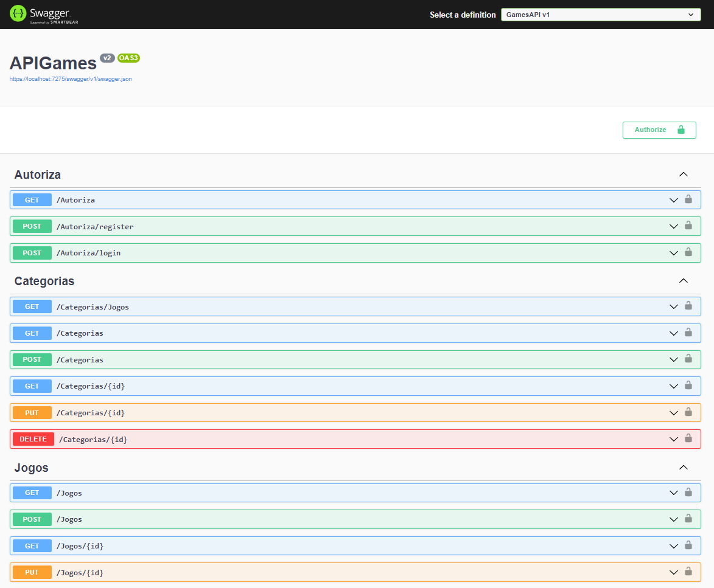

# API Core Games 2.0

# Descrição
Este projeto consiste na criação de uma API Core. 
Foi criada uma aplicação ASP Net Core Web API .net 6.0 utilizando:
<ul>
  <li>Swagger para implementação de uma interface que permita testar a aplicação e documentar a API.</li>
  <li>Conexão com Banco de dados MySql via EF Core DbContext.</li>
  <li>EF Core Migrations para construção do Banco de dados.</li>
  <li>Data Annotations para estrutura das tabelas.</li>
  <li>Aplicação dos padrões: Repository e Unity of Work.</li>
  <li>Biblioteca AutoMapper para realizar o mapeamento das classes.</li>
  <li>Paginação de dados na API.</li>
  <li>Programação Assíncrona.</li>
</ul>
  
Através desta API podemos:

<ul>
  <li>Manipular as informações de jogos através dos 4 prinipais verbos HTTP</li>
  <li>GET, POST, PUT e DELETE.</li>
</ul>

# Layout do Projeto

  

# Tecnologias Utilizadas

<ul>
  <li>C#</li>
  <li>.net 6.0</li>
  <li>Swagger</li>
  <li>Visual Studio 2022</li>
  <li>MySql Workbench</li>
  <li>Postman</li>
  <li>Git</li>
</ul>

# Autor
José Ricardo Chies Gonçalves

LinkedIn:
https://www.linkedin.com/in/ricardo-chies-087557216/

E-mail:
chies.dev@gmail.com
